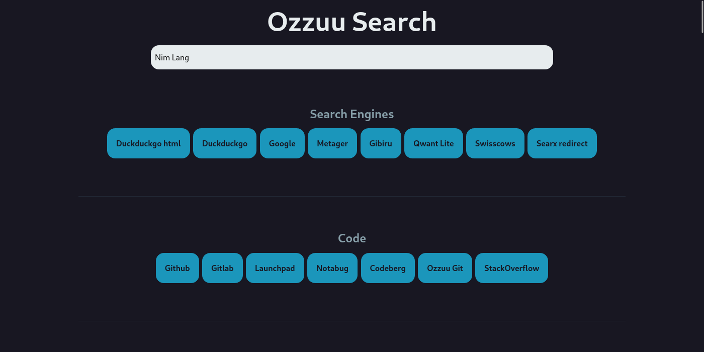

# **Ozzuu Search**

#### Open source, secure and privacy friendly meta search portal

**[About](#about) - [Features](#features)** - [License](#license)

## About

Ozzuu Search is a frontend-only web page that helps you search across multiple websites!

## Features

- Free and open source
- Local search history saved in local storage
- Customizable config, can add custom searches and custom default search
- Made with Nim :)
- No need to export all your search engines to another browser, just copy the link
- Short commands automatically redirect
- Easy and clean UI

## TODO

- [x] Settings (saved in GET parameters)
  - [x] Default search
  - [x] Delay to auto go to default
  - [ ] Disable auto go to default
  - [x] Add custom searches
  - [ ] Themes? Maybe in future
  - [ ] Remove referrer
- [ ] Add option to remove item from history
- [ ] Enter go to short (like in page loading) or reload

## License

This software is FOSS, licensed over GPL-3.
